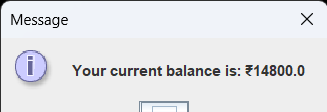

# Personal Finance Tracker 💰  

A **Java-based desktop application** to manage personal finances. Users can track income & expenses, search transactions, and check balance through a simple, interactive **Java Swing GUI** with **MySQL database** integration.  

---

## 🚀 Features  
- User registration & login with authentication 🔐  
- Add, update, delete, and view transactions  
- Search transactions by:  
  - Month  
  - Date Range  
  - Transaction ID  
- Real-time balance check  
- Clean and simple dashboard  

---

## 🛠️ Tech Stack  
- **Java** (Core + Swing for GUI)  
- **MySQL** (Database)  

---

## 📂 Project Structure  
```
FinanceTracker/
 ┣ src/
 ┃ ┣ application/
 ┃ ┃ ┗ FinanceTrackerMain.java   <-- Main entry point  
 ┃ ┣ dao/                        <-- Database access layer  
 ┃ ┣ model/                      <-- Transaction & User models  
 ┃ ┗ ui/                         <-- Swing UI classes  
 ┗ resources/                    <-- Config files / DB scripts
```

---

## ⚡ How to Run  
1. Clone this repository:  
   ```bash
   git clone https://github.com/YashWaghmare2206/Personal-Finance-Tracker.git
   ```
2. Open the project in IntelliJ IDEA (or any Java IDE).  
3. Set up the database:  
   - Create a MySQL database (e.g., `finance_tracker`).  
   - Import the provided SQL script (if available) or create the required tables manually.  
   - Update DB connection details in the code (`username`, `password`, `db name`).  
4. Run the application:  
   - Go to the `application` folder.  
   - Run **`FinanceTrackerMain.java`**.  
5. Login/Register and start tracking your finances!  

---

## 📸 Screenshots

### Dashboard


### Register Page


### Login Page


### Transactions


### Balance


### Add Transaction


### Monthly Transactions


### Delete Transaction


### Search Transactions by Date Range


### And Much More 

## 🔗 Links  
- **GitHub Repo**: [Personal-Finance-Tracker](https://github.com/YashWaghmare2206/Personal-Finance-Tracker)  
